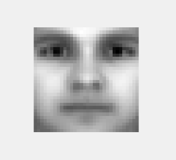
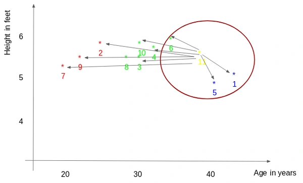
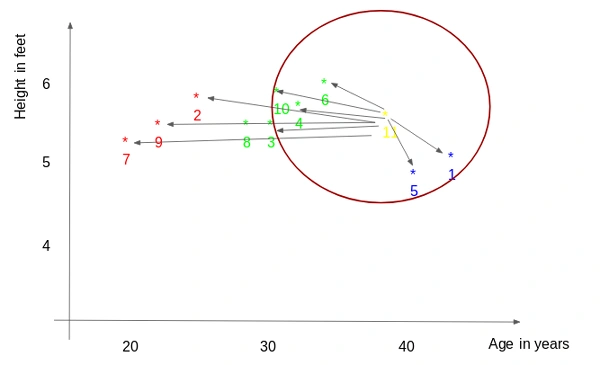

# 基于 PCA 的人脸识别系统

|学号|姓名|
|:---|:---|
|AIT2409033|[Liu Zhen](https://github.com/Stanley-oss)|
|DSC2409006|[Cui Zeyu](https://github.com/zeyu10)|

[Report-CN](ReportDS-CN-GitHub.pdf)

[Report-EN](ReportDS-EN-GitHub.pdf)

## 一、引言

本项目聚焦于设计并实现一个基于主成分分析（PCA）的人脸识别系统。其目的在于为各类场景下的人员身份识别需求提供可靠、高效的解决方案。通过收集、处理大量人脸数据，运用 PCA 技术提取关键特征，并结合分类算法，该系统能够准确地识别出人员身份，为实际应用提供有力支持。

## 二、使用方法

### （一）环境搭建与数据准备

1. **安装依赖库**：本系统基于 Python 语言开发，运行前需确保已安装 Python 环境。项目主要依赖 `OpenCV`、`NumPy`、`PyQt5` 等库。可使用 `pip` 工具进行安装，在命令行中依次执行 `pip install opencv-python`、`pip install numpy`、`pip install PyQt5` 等命令，完成依赖库的安装。
2. **收集人脸数据**：将收集到的人脸图像按照人员进行分类，分别存储在不同的文件夹下。每个文件夹的名称作为对应人员的标识，图像格式支持 `.jpg`、`.jpeg`、`.png` 。确保图像质量良好，背景相对简单，以提高后续识别的准确率。

### （二）项目内容概览

**项目结构概览**：

```out
FaceRecognition/
│
├── Config.py                # 配置文件，包含系统参数和常量
├── Dataset.py               # 数据集处理模块，负责数据导入、处理和保存
├── FaceDetector.py          # 人脸检测模块，负责检测和预处理人脸图像
├── Recognizer.py            # 识别模块，实现 PCA 和 kNN 算法
├── MainWindow.py            # 主界面模块，提供用户界面和系统功能集成
│
├── Caffemodel/              # 预训练的深度学习模型文件
│   ├── deploy.prototxt      # 模型配置文件
│   └── res10_300x300_ssd_iter_140000.caffemodel
│                            # 模型权重文件
│
├── Dataset/                 # 数据集文件夹，存储原始图像和预处理后的数据
│   ├── Att_Faces/           # 包含 Att_Faces 数据集的原始图像
│   ├── Dataset_Personal/    # 包含带背景的个人数据集
│   ├── Dataset_Pure/        # 包含纯个人数据集
│   ├── Dataset_Personal_Big.pkl            # 大型个人数据集的预处理文件
│   ├── Dataset_Personal_Small.pkl          # 小型个人数据集的预处理文件
│   └── Dataset_Personal_with_AttFaces.pkl  # 包含 Att_Faces 的个人数据集预处理文件
│
├── Report.pdf               # 项目报告文档
```

**文件功能说明**：

#### 1. Config.py

- **功能**：配置文件，定义了系统中使用的常量参数。
- **关键参数**：
  - `FACE_EXTEND_FACTOR`：人脸区域扩展因子。
  - `TRAIN_RATIO`：训练集和测试集的分割比例。
  - `KEEP_COMPONENTS`：PCA 保留的主成分比例。
  - `RECOGNITION_SIZE`：人脸图像的统一尺寸。
  - `CANDIDATE_K`：kNN 算法中候选的 k 值列表。

#### 2. Dataset.py

- **功能**：数据集处理模块，负责数据导入、处理和保存。
- **核心功能**：
  - `import_dataset`：从文件夹导入人脸图像数据，并进行预处理。
  - `save_dataset`：将数据集保存为 `.pkl` 文件。
  - `load_dataset`：从 `.pkl` 文件加载数据集。
  - `split_dataset`：将数据集分割为训练集和测试集。

#### 3. FaceDetector.py

- **功能**：人脸检测模块，负责检测和预处理人脸图像。
- **核心功能**：
  - `detect_faces`：使用深度学习模型检测人脸。
  - `get_most_confident_face_region`：获取最自信的人脸区域。
  - `enhance_image`：对图像进行增强和背景去除。

#### 4. Recognizer.py

- **功能**：识别模块，实现 PCA 和 kNN 算法。
- **核心功能**：
  - `fit`：使用 PCA 进行特征提取。
  - `evaluate`：评估模型的准确率。
  - `predict`：使用 kNN 算法进行人脸识别。
  - `kNNR_classifier`：kNN 分类器实现。

#### 5. MainWindow.py

- **功能**：主界面模块，提供用户界面和系统功能集成。
- **核心功能**：
  - `MainWindow`：主窗口类，集成数据导入、模型训练、相机操作等功能。
  - `CameraWindows`：相机窗口类，提供实时人脸检测和识别功能。
  - `slot_add_face`：在界面中添加人脸数据。
  - `on_train_model`：训练模型并显示训练进度。

#### 6. Caffemodel/

- **功能**：存放预训练的深度学习模型文件。
- **文件**：
  - `deploy.prototxt`：模型配置文件。
  - `res10_300x300_ssd_iter_140000.caffemodel`：模型权重文件。

#### 7. Dataset/

- **功能**：存储数据集的原始图像、储存数据集的预处理文件。
- **内容**：
  - `Att_Faces/` ：存储 Att_Faces 数据集的原始图像，共 **400** 张。
  - `Dataset_Personal_With_Background/`：存储小组成员个人数据集，共 **65** 张。
  - `Dataset_Pure/`：存储个人数据集，共 **103** 张。
  - `Dataset_Personal_Big.pkl`：
    - 包含 `Dataset_Personal_With_Background/` + `Dataset_Pure/`。
  - `Dataset_Personal_Small.pkl`：
    - 仅有 `Dataset_Personal_With_Background/`。
  - `Dataset_Personal_with_AttFaces.pkl`：
    - 包含 `Dataset_Personal_With_Background/` + `Dataset_Pure/` + `Att_Faces/`。

### （三）项目操作流程

1. **启动项目**：找到项目目录中的 `MainWindow.py` 文件，在命令行中运行 `python MainWindow.py` 命令，启动人脸识别系统。系统启动后，会弹出主窗口，该窗口集成了数据导入、模型训练、相机操作、数据集管理等功能按钮，以及图像显示区域和数据表格。


2. **导入数据**
    - 点击主窗口中的 `Import From Folder` 按钮，系统会弹出文件选择对话框。在对话框中导航至存储人脸图像的文件夹，选中该文件夹后点击“确定”。
    - 此时系统会弹出询问框，询问是否去除人脸背景。若选择“是”，系统将在后续处理中运用图像处理技术去除人脸背景；若选择“否”，则保留原始图像背景。
    - 系统开始读取所选文件夹及其子文件夹中的图像文件。对于尺寸过大（像素超过 62500）的图像，系统会基于 `OpenCV` 的 `dnn` 模块进行人脸检测，获取最自信的人脸区域，并依据配置文件中的 `FACE_EXTEND_FACTOR` 参数进行扩展裁剪。随后，将图像统一调整为尺寸为 `RECOGNITION_SIZE`（100x100）的图像。
    - 处理完成的图像数据会存储在系统的数据集内。同时，在主窗口的数据表格中，会显示每张图像对应的 ID、姓名（根据文件夹名确定）、路径以及是否添加到模型的勾选框等信息。  
    

3. **模型训练**
    - 在进行模型训练前，需确保数据表格中已导入足够的人脸数据。若数据集为空，点击 `Train Model` 按钮时，系统会弹出错误提示框，提示用户先导入数据。
    - 确认数据无误后，点击 `Train Model` 按钮，系统开始模型训练。训练过程中，主窗口底部的进度条会实时显示训练的进展情况。
    - 模型训练包含多个关键步骤，首先对导入的数据进行处理，提取关键特征；接着计算如均值脸、协方差矩阵、特征值和特征向量等相关参数；最后对模型进行评估，确定模型的性能指标。
    - 训练完成后，主窗口的状态栏会显示训练所花费的时间以及模型的准确率，方便用户了解模型训练效果。
    - 可导入多个文件夹（数据集）进行训练，同时也可在右下面板选择本次要训练的人脸，每次调用摄像头进行识别前均要进行训练。  
    

4. **开启相机进行识别**
    - 在主窗口中点击 `Open Camera` 按钮。若首次打开相机，系统会弹出相机选择窗口，列出当前设备上可用的相机设备。用户可根据实际情况选择对应的相机设备（若只有一个相机设备，系统会自动选择并打开）。相机窗口打开后，用户可实时查看相机拍摄的画面。
    - 在相机窗口中，点击 `Recognize Face` 按钮。若模型已成功训练完成，该按钮会变为 `Stop Recognizing`，同时开启人脸识别功能。系统会在相机实时画面中检测人脸，一旦检测到人脸，会对其进行一系列处理和识别操作。
    - 识别结果会实时显示在相机画面上。若识别出是已知人员，会在画面上显示人员姓名；若未识别出，则显示 `Stranger`。此外，在相机窗口的右侧小窗口中，会分别显示检测到的人脸图像以及预测的匹配图像（若识别成功），方便用户直观对比。
    - 在相机窗口中，用户可通过勾选 `Remove Background` 复选框来决定是否对检测到的人脸图像进行背景去除处理。勾选后，系统会在处理人脸图像时运用相关图像处理算法去除背景，以进一步提高识别效果。
    - 点击相机窗口中的 `Screenshot` 按钮，可对当前相机画面进行拍照操作。拍摄的照片会以 `Screenshot_yy_dd_hh_mm_ss.jpg` 的格式保存在程序运行目录下，同时相机窗口的状态栏会提示照片保存的文件名，方便用户查找。
    - 调用摄像头测试 (Camera 0)  
    
    - 本地数据集测试 (Camera 1 or Camera 2，需借助 OBS 虚拟摄像头)  
    
    

5. **调整识别阈值**
    - 在主窗口的左侧操作面板中，用户可以看到一个滑块控件，用于调整人脸识别的阈值。阈值决定了系统在识别过程中对相似度的要求。阈值越低，系统对相似度的要求越宽松，识别结果可能包含更多的误识别；阈值越高，系统对相似度的要求越严格，识别结果更加准确，但可能会漏掉一些相似度较低的正确识别。
    - 用户可以通过拖动滑块来调整阈值，滑块的值范围从 0 到 200，对应的阈值范围为 0.0 到 2.0。系统默认的初始值为 100，对应的阈值为 1.0。用户可以根据实际需求调整阈值，以达到最佳的识别效果。
    - 调整阈值后，系统会实时更新识别结果，用户可以通过观察相机窗口中的识别结果来判断当前阈值是否合适。
    - 经过测试，阈值为 1.20 时为临界值，此时识别系统较为敏感。  
    

6. **数据集操作**
    - 用户可对已处理的图片进行保存：点击主窗口中的 `Save Dataset` 按钮，系统会弹出文件保存对话框。用户可在对话框中选择保存路径，并输入文件名（文件格式为 `.pkl`），点击 `保存` 后，系统会将当前系统中的数据集保存下来，以便后续使用。  
    
    - 用户可导入已保存的预处理文件：点击 `Load Dataset` 按钮，系统弹出文件选择对话框。选择之前保存的数据集文件（`.pkl`），系统会加载数据集，并将数据显示在主窗口的数据表格中，同时更新相关数据索引，方便用户继续进行后续操作。  
    

## 三、重要原理

### （一）主成分分析（PCA）

#### 1. PCA 基本原理

PCA 是一种强大的数据降维技术，其核心目标是通过线性变换，将高维数据投影到一组正交的主成分上，使得数据在低维空间中能够保留大部分的方差信息。在人脸识别领域，每一张人脸图像都可以看作是一个高维向量，这些向量构成了一个高维的数据空间。通过 PCA，我们能够找到那些能够最大程度解释数据方差的方向，这些方向对应的向量就是所谓的“特征脸”。利用这些特征脸，我们可以将高维的人脸图像数据投影到一个低维空间中，实现数据降维的同时，保留关键的识别特征，从而大大减少计算量和存储需求。

#### 2. PCA 数学原理

- **数据矩阵构建**：假设有 $m$ 个人脸图像，每个图像被表示为一个 $n$ 维向量（假设图像已被拉直成一维向量），则可以构建一个大小为 $n\times m$ 的数据矩阵 $X$，其中每一列代表一个人脸图像向量。

- **计算均值向量**：计算数据矩阵 $X$ 的均值向量 $\mu$，公式为：  
$$\mu=\frac{1}{m}\sum_{i = 1}^{m}x_{i}$$  
其中， $x_{i}$ 表示第 $i$ 个图像向量。均值向量 $\mu$ 代表了数据的中心趋势。从几何角度来看，它是所有数据点在 $n$ 维空间中的重心。在人脸识别中，均值脸可以看作是所有人脸的平均模样，反映了人脸的基本特征。
  - “平均脸”，即所有人脸的平均：  
  

- **数据中心化**：将数据矩阵 $X$ 中的每个向量减去均值向量 $\mu$，得到中心化的数据矩阵 $X_{centered}$，即：  
$$X_{centered}=X - \mu\mathbf{1}^{T}$$  
其中， $\mathbf{1}$ 是一个大小为 $m$ 的全 $1$ 向量。数据中心化的目的是使数据分布以原点为中心，消除数据的平移影响，突出数据的差异特征，为后续的特征提取做准备。经过中心化后，数据的均值变为零，使得后续计算协方差矩阵时更加方便和准确。
  - 原始数据在减去平均脸后得到的中心化的数据：  
  

- **计算协方差矩阵**：计算中心化后数据矩阵 $X_{centered}$ 的协方差矩阵 $C$，公式为：  
$$C=\frac{1}{m - 1}X_{centered}X_{centered}^{T}$$  
协方差矩阵 $C$ 反映了数据各个维度之间的相关性，其对角线元素表示各个维度的方差，非对角线元素表示不同维度之间的协方差。在人脸识别中，协方差矩阵描述了人脸图像各个像素之间的相关性。例如，如果两个像素在不同人脸图像中的变化趋势相似，那么它们之间的协方差就会较大；反之，如果变化趋势相互独立，协方差就会接近零。

- **求解特征值和特征向量**：对协方差矩阵 $C$ 进行特征分解，求解其特征值 $\lambda_{i}$ 和特征向量 $v_{i}$，满足：  
$$Cv_{i}=\lambda_{i}v_{i}$$  
特征值 $\lambda_{i}$ 表示对应特征向量 $v_{i}$ 方向上的数据方差大小，特征向量 $v_{i}$ 则表示数据在该方向上的变化方向。从线性代数的角度来看，特征向量是协方差矩阵 $C$ 所定义的线性变换下的不变方向，而特征值则是该方向上的缩放因子。在人脸识别中，特征向量（即特征脸）代表了人脸图像中最具变化性的方向，特征值越大，说明该特征脸包含的信息越多，对数据的解释能力越强。
  - 把特征脸按照特征值大小排列，可以看到特征值大的脸包含的有效信息更多。  
  

- **特征值分解的理论基础**：根据线性代数中的谱定理，对于实对称矩阵（协方差矩阵 $C$ 是实对称矩阵），存在一个正交矩阵 $Q$，使得 $C = Q\Lambda Q^{T}$，其中 $\Lambda$ 是一个对角矩阵，其对角元素为 $C$ 的特征值 $\lambda_{i}$， $Q$ 的列向量为对应的特征向量 $v_{i}$。这一理论保证了我们可以通过特征分解将协方差矩阵 $C$ 对角化，从而找到数据的主成分。

- **选择主成分**：将特征值按照从大到小的顺序进行排序，即 $\lambda_{1}\geq\lambda_{2}\geq\cdots\geq\lambda_{n}$。根据设定的主成分保留比例（如 `KEEP_COMPONENTS` 为 0.95），选择前 $k$个 特征向量作为主成分，使得累计贡献率达到设定比例。累计贡献率的计算公式为：  
$$\sum_{i = 1}^{k}\lambda_{i}/\sum_{i = 1}^{n}\lambda_{i}\geq0.95$$  
这 $k$ 个特征向量构成了特征脸空间的基向量，用于后续的数据投影和特征提取。选择合适的主成分数量是 PCA 的关键步骤之一，它需要在保留足够信息和降低数据维度之间进行权衡。如果保留的主成分过多，虽然可以保留更多的信息，但降维效果不明显；如果保留的主成分过少，则可能会丢失重要的识别特征，导致识别准确率下降。

- **数据投影**：将原始的人脸图像向量 $x$ 投影到由所选特征向量构成的低维空间中，得到投影后的向量 $y$，投影公式为：  
$$y = V^{T}(x - \mu)$$  
其中， $V$ 是由前 $k$ 个特征向量组成的矩阵，每一列是一个特征向量。通过投影，将高维的人脸图像数据转换为低维的特征向量表示，实现了数据降维。在低维空间中，数据的计算量和存储需求大大减少，同时由于保留了主要的方差信息，仍然能够进行有效的人脸识别。

#### 3. PCA 简单数据示例

- Plot data  

- Find the centre of the data  

- Shift the data points so the centre is now at (0, 0)  

- Find the line of best fit PC1  

- Find another line PC2  

- Rotate the chart so PC1 is the x-axis and PC2 is the y-axis  


#### 4. PCA 中高效计算特征向量的方法

在实际应用中，直接计算高维图像的协方差矩阵的特征向量在计算量上是不可行的。例如，对于一个 $100×100$ 的灰度图像，每个图像是一个 $10,000$ 维空间中的一个点，协方差矩阵 $S$ 的大小为 $10,000×10,000$，具有 $10^8$ 个元素。然而，协方差矩阵的秩受到训练图像数量的限制：如果有 $N$ 个训练样本，则最多有 $N-1$ 个对应非零特征值的特征向量。如果训练样本的数量比图像的维数低，可以通过以下方法简化特征向量的计算。

##### A. 数据矩阵的构建与预处理

设 $T$ 是预处理图像的矩阵，每一列对应一个减去均值图像之后的图像。假设我们有 $N$ 个训练样本，每个样本是一个 $D$ 维向量（例如， $100×100$ 的图像拉直成 $10,000$ 维向量），则数据矩阵 $T$ 的大小为 $D \times N$。

##### B. 协方差矩阵的计算

协方差矩阵 $S$ 可以表示为：  
$$S = \frac{1}{N-1} TT^T$$  
其中， $TT^T$ 是一个 $D \times D$ 的矩阵。直接计算这个矩阵的特征向量在计算量上是不可行的，特别是当 $D$ 很大时。

##### C. 特征值分解的简化

为了简化计算，我们可以转而计算 $T^T T$ 的特征向量。设 $T^T T$ 的特征向量为 $u_i$，对应的特征值为 $\lambda_i$，则有：  
$$T^T T u_i = \lambda_i u_i$$  
如果在等式两边乘以 $T$，可以得到：  
$$TT^T T u_i = \lambda_i T u_i$$  
这意味着，如果 $u_i$ 是 $T^T T$ 的一个特征向量，则 $v_i = T u_i$ 是 $S$ 的一个特征向量。由于 $T^T T$ 是一个 $N \times N$ 的矩阵，通常 $N$ 远小于 $D$，因此计算 $T^T T$ 的特征向量要容易得多。

##### D. 特征向量的归一化

需要注意的是，通过上述方法计算得到的特征向量 $v_i$ 没有进行归一化。为了确保特征向量的单位长度，我们需要对 $v_i$ 进行归一化处理：  
$$v_i = \frac{T u_i}{\|T u_i\|}$$  
其中， $\|T u_i\|$ 表示向量 $T u_i$ 的范数。

##### E. 计算复杂度分析

通过上述方法，我们将计算复杂度从 $O(D^3)$ 降低到 $O(N^3)$，其中 $D$ 是图像的维数， $N$ 是训练样本的数量。由于 $N$ 通常远小于 $D$，这种方法大大减少了计算量，使得在高维数据上进行 PCA 变得可行。

假设我们有 $300$ 张 $100×100$ 像素的图像，每张图像拉直后是一个 $10,000$ 维的向量。直接计算 $10,000×10,000$ 的协方差矩阵的特征向量在计算上是不可行的。通过上述方法，我们只需要计算 $300×300$ 的矩阵 $T^T T$ 的特征向量，然后通过简单的矩阵乘法得到协方差矩阵的特征向量。

#### 5. PCA 在人脸识别中的优势

- **去除冗余信息**：人脸图像数据通常存在大量的冗余信息，例如相邻像素之间的相关性较高。PCA 通过找到数据的主成分，能够去除这些冗余信息，只保留最具代表性的特征，从而提高识别效率和准确性。
- **降低维度灾难**：在高维空间中，数据的分布往往比较稀疏，容易导致“维度灾难”问题，即分类器的性能随着维度的增加而下降。PCA 将高维的人脸图像数据投影到低维空间中，有效缓解了维度灾难问题，使得分类器能够更好地学习和识别数据。
- **特征提取能力强**：PCA 提取的特征脸是数据中最具变化性的方向，它们能够捕捉到人脸的主要特征，如面部轮廓、眼睛、鼻子、嘴巴等的形状和位置信息。这些特征对于人脸识别具有重要的意义，能够提高识别的准确性。

### （二）K 近邻重分类器（kNNR）

#### 1. kNNR 基本原理

kNNR 是一种基于实例的分类算法，在人脸识别系统中发挥着关键的分类作用。其核心思想是在训练集中寻找与待识别样本距离最近的 $k$ 个邻居，根据这 $k$ 个邻居的类别分布来预测待识别样本的类别。在本系统中，通过计算待识别图像与训练集中所有图像的距离，选取距离最近的 $k$ 个样本，然后统计这 $k$ 个样本中出现次数最多的类别作为预测结果。若存在多个类别出现次数相同的情况，则选择距离最近的样本类别作为最终预测结果。

#### 2. kNNR 数学原理

- **距离度量**：假设训练集包含 $N$ 个样本，每个样本 $x_{i}$ 都有对应的类别标签 $y_{i}$。对于待识别样本 $x$，计算它与训练集中每个样本 $x_{i}$ 的距离 $d(x, x_{i})$，通常使用欧氏距离作为度量，公式为：  
$$d(x, x_{i})=\sqrt{\sum_{j = 1}^{n}(x_{j}-x_{ij})^{2}}$$  
其中， $x_{j}$ 和 $x_{ij}$ 分别是待识别样本 $x$ 和训练样本 $x_{i}$ 的第 $j$ 个特征值。欧氏距离是最常用的距离度量方法，它直观地反映了两个样本在特征空间中的几何距离。在人脸识别中，欧氏距离可以衡量两个人脸图像在特征空间中的相似度，距离越小，说明两个图像越相似。
  - Simple example  
  
  
  - Calculate the distance between the new point and each training point  
  

- **k 值的选择**：k值的选择是 kNNR 算法的关键参数之一。如果 $k$ 值选择过小，模型容易受到噪声的影响，导致过拟合；如果 $k$ 值选择过大，模型会过于平滑，忽略了局部的特征信息，导致欠拟合。通常可以通过交叉验证的方法来选择合适的 $k$ 值，即在训练集上划分不同的验证集，对不同的 $k$ 值进行测试，选择使得验证集上分类准确率最高的 $k$ 值。
  - For a value k = 3, the closest points are ID 1, ID 5 and ID 6.  
  
  
  - For the value of k = 5, the closest point will be ID 1, ID 4, ID 5, ID 6 and ID 10.  
  

- **投票决策**：选取距离 $x$ 最近的 $k$ 个样本，这 $k$ 个样本构成一个邻域。统计邻域中各个类别出现的次数，设类别 $c$ 出现的次数为 $n_{c}$。预测待识别样本 $x$ 的类别为出现次数最多的类别，即：  
$$\hat{y}=\arg\max_{c}n_{c}$$  
如果存在多个类别出现次数相同的情况，即有多个 $c$ 使得 $n_{c}$ 最大，则在这些类别对应的样本中，选择距离 $x$ 最近的样本所属的类别作为待识别样本 $x$ 的预测类别。

- **阈值的作用**：在人脸识别系统中，阈值用于控制识别的严格程度。具体来说，阈值决定了待识别样本与训练样本之间的最小距离。如果待识别样本与最近邻样本的距离小于阈值，则认为识别成功；否则，识别失败，返回“陌生人”结果。阈值的设置直接影响系统的识别准确率和误识别率。较低的阈值会增加系统的灵敏度，但可能导致更多的误识别；较高的阈值会提高系统的准确性，但可能导致漏识别。

- **阈值的动态调整**：为了适应不同的应用场景和需求，系统提供了动态调整阈值的功能。用户可以通过滑块控件实时调整阈值，观察识别结果的变化，从而找到最适合当前场景的阈值设置。

#### 3. kNNR 在人脸识别中的优势

- **简单易懂**：kNNR 算法的原理简单直观，不需要复杂的模型训练过程，只需要存储训练样本和对应的类别标签即可。在进行预测时，只需要计算待识别样本与训练样本的距离，然后进行投票决策，易于实现和理解。
- **适应性强**：kNNR 算法不需要对数据的分布进行假设，能够适应各种不同类型的数据。在人脸识别中，由于人脸图像的多样性和复杂性，数据的分布往往比较复杂，kNNR 算法能够较好地处理这种情况，具有较强的适应性。
- **局部性好**：kNNR 算法是一种基于局部信息的分类算法，它只考虑待识别样本周围的邻居样本，能够捕捉到数据的局部特征。在人脸识别中，局部特征对于区分不同的人脸具有重要的意义，kNNR 算法能够充分利用这些局部特征，提高识别的准确性。

## 四、核心代码及其解释

### 1. PCA 核心代码与解释

#### 代码片段 1：PCA 数据预处理

```python
def fit(self, keep_components_ratio):
    # 计算均值脸
    self.mean_face = self.train_matrix.mean(axis=1, keepdims=True)
    # 数据中心化
    self.centered_data = self.train_matrix - self.mean_face

    # 计算协方差矩阵
    cov_matrix = np.dot(self.centered_data.T, self.centered_data) / (self.train_matrix.shape[1] - 1)
    # 特征值分解
    eig_vals, eig_vecs = np.linalg.eig(cov_matrix)
    # 对特征值排序
    sorted_indices = np.argsort(eig_vals)[::-1]
    eig_vecs = eig_vecs[:, sorted_indices]
    eig_vals = eig_vals[sorted_indices]

    # 计算累计方差贡献率
    eig_vals_total = np.sum(eig_vals)
    variance_explained = np.cumsum(eig_vals) / eig_vals_total
    # 选择主成分数量
    num_components = np.argmax(variance_explained >= keep_components_ratio) + 1

    # 选择前 k 个特征向量
    eig_vecs = eig_vecs[:, :num_components]
    # 计算特征脸
    self.eigenfaces = np.dot(self.centered_data, eig_vecs)
    # 归一化特征脸
    eigenface_norms = np.linalg.norm(self.eigenfaces, axis=0, keepdims=True)
    eigenface_norms[eigenface_norms == 0] = 1
    self.eigenfaces /= eigenface_norms
```

#### 代码片段 1 文字解释

1. **均值脸计算**：
   - 均值脸是所有人脸图像的平均特征，反映了人脸的基本结构。通过计算均值脸，我们可以将所有人脸图像对齐到一个共同的中心点，便于后续的特征提取。
   - 代码中，`self.mean_face = self.train_matrix.mean(axis=1, keepdims=True)` 计算了训练数据的均值脸。
   - `self.centered_data = self.train_matrix - self.mean_face` 将数据中心化，使得数据分布以原点为中心。

2. **协方差矩阵计算**：
   - 协方差矩阵反映了数据各个维度之间的相关性。在人脸识别中，协方差矩阵描述了人脸图像各个像素之间的相关性。
   - 代码中，`cov_matrix = np.dot(self.centered_data.T, self.centered_data) / (self.train_matrix.shape[1] - 1)` 计算了中心化数据的协方差矩阵。

3. **特征值分解**：
   - 特征值分解是 PCA 的核心步骤，通过分解协方差矩阵，我们可以得到特征值和特征向量。特征值表示数据在各个方向上的方差大小，特征向量表示数据的变化方向。
   - 代码中，`eig_vals, eig_vecs = np.linalg.eig(cov_matrix)` 对协方差矩阵进行特征值分解。
   - `sorted_indices = np.argsort(eig_vals)[::-1]` 对特征值从大到小排序。

4. **选择主成分**：
   - 主成分是数据中最具变化性的方向，选择合适的主成分数量可以在保留足够信息的同时降低数据维度。
   - 代码中，`variance_explained = np.cumsum(eig_vals) / eig_vals_total` 计算了累计方差贡献率。
   - `num_components = np.argmax(variance_explained >= keep_components_ratio) + 1` 根据设定的保留比例（如 95%）选择主成分数量。

5. **特征脸计算**：
   - 特征脸是 PCA 提取的关键特征，代表了人脸图像中最具变化性的方向。
   - 代码中，`self.eigenfaces = np.dot(self.centered_data, eig_vecs)` 将中心化数据投影到特征向量空间，得到特征脸。

### 2. kNN 核心代码与解释

#### 代码片段 2：kNN 分类器

```python
def kNNR_classifier(self, distances, k, train_labels):
    # 找到距离最近的 k 个邻居
    knn_indices = np.argpartition(distances, k - 1)[:k]
    knn_labels = train_labels[knn_indices]

    # 统计 k 个邻居中每个标签出现的次数
    unique_labels, counts = np.unique(knn_labels, return_counts=True)
    max_count = counts.max()
    candidate_labels = unique_labels[counts == max_count]

    # 处理平局情况
    best_index = None
    best_distance = float('inf')
    for label in candidate_labels:
        indices = knn_indices[knn_labels == label]
        local_idx = indices[np.argmin(distances[indices])]
        if distances[local_idx] < best_distance:
            best_distance = distances[local_idx]
            best_index = local_idx

    return best_index
```

#### 代码片段 2 文字解释

1. **选择最近邻**：
   - kNN 算法的核心思想是通过计算待识别样本与训练样本的距离，找到距离最近的 k 个邻居。
   - 代码中，`knn_indices = np.argpartition(distances, k - 1)[:k]` 找到距离最近的 k 个邻居的索引。
   - `knn_labels = train_labels[knn_indices]` 获取这 k 个邻居的标签。

2. **投票决策**：
   - 在 k 个邻居中，统计每个标签出现的次数，选择出现次数最多的标签作为预测结果。
   - 代码中，`unique_labels, counts = np.unique(knn_labels, return_counts=True)` 统计 k 个邻居中每个标签出现的次数。
   - `max_count = counts.max()` 找到出现次数最多的标签。

3. **处理平局**：
   - 如果多个标签出现次数相同，选择距离最近的样本的标签作为最终预测结果。
   - 代码中，`best_index = None` 和 `best_distance = float('inf')` 用于记录距离最近的样本索引。

### 3. 人脸检测核心代码与解释

#### 代码片段 3：人脸检测

```python
def detect_faces(self, image):
    (h, w) = image.shape[:2]
    blob = cv2.dnn.blobFromImage(cv2.resize(image, (300, 300)), 1.0, (300, 300), (104.0, 177.0, 123.0))
    self.net.setInput(blob)
    return self.net.forward()
```

#### 代码片段 3 文字解释

1. **图像预处理**：
   - 人脸检测的第一步是将输入图像调整为固定大小（如 300x300），并进行归一化处理。
   - 代码中，`blob = cv2.dnn.blobFromImage(...)` 将输入图像调整为 300x300 大小，并进行归一化处理。

2. **人脸检测**：
   - 使用预训练的深度学习模型进行人脸检测，返回检测结果。
   - 代码中，`self.net.setInput(blob)` 将预处理后的图像输入到神经网络中。
   - `return self.net.forward()` 返回神经网络的人脸检测结果。

### 4. 数据集处理核心代码与解释

#### 代码片段 4：数据集分割

```python
def split_dataset(self, matrix, labels, train_ratio):
    train_data = []
    train_labels = []
    test_data = []
    test_labels = []
    for label in np.unique(labels):
        indices = np.where(labels == label)[0]
        indices = np.random.permutation(indices)
        train_num = int(len(indices) * train_ratio)
        train_indices = indices[:train_num]
        test_indices = indices[train_num:]
        train_data.append(matrix[:, train_indices])
        test_data.append(matrix[:, test_indices])
        train_labels.extend([label] * len(train_indices))
        test_labels.extend([label] * len(test_indices))

    train_data = np.hstack(train_data)
    test_data = np.hstack(test_data)
    train_labels = np.array(train_labels)
    test_labels = np.array(test_labels)
    return train_data, train_labels, test_data, test_labels
```

#### 代码片段 4 文字解释

1. **数据集分割**：
   - 按照设定的训练比例（如 80%）将数据集分为训练集和测试集。
   - 代码中，`train_num = int(len(indices) * train_ratio)` 计算每个类别的训练样本数量。
   - `train_indices = indices[:train_num]` 和 `test_indices = indices[train_num:]` 分别获取训练集和测试集的索引。

2. **数据合并**：
   - 将每个类别的训练数据和测试数据合并为完整的训练集和测试集。
   - 代码中，`train_data = np.hstack(train_data)` 和 `test_data = np.hstack(test_data)` 将每个类别的数据合并。

### 5. 图像预处理核心代码与解释

#### 代码片段 5：图像增强

```python
def enhance_image(self, image, remove_background=True):
    ycrcb_face = cv2.cvtColor(image, cv2.COLOR_BGR2YCR_CB)
    channels = cv2.split(ycrcb_face)
    channels = list(channels)
    clahe = cv2.createCLAHE(clipLimit=2.0, tileGridSize=(8,8))
    channels[0] = clahe.apply(channels[0])
    cv2.merge(channels, ycrcb_face)
    image = cv2.cvtColor(ycrcb_face, cv2.COLOR_YCR_CB2BGR)
    if remove_background:
        blurred_face = cv2.GaussianBlur(image, (7, 7), 0)
        mask = np.zeros(image.shape[:2], np.uint8)
        bgd_model = np.zeros((1, 65), np.float64)
        fgd_model = np.zeros((1, 65), np.float64)
        rect = (int(Config.RECOGNITION_SIZE * 0.04),
                int(Config.RECOGNITION_SIZE * 0.04),
                image.shape[1] - int(Config.RECOGNITION_SIZE * 0.08),
                image.shape[0] - int(Config.RECOGNITION_SIZE * 0.08))
        cv2.grabCut(blurred_face, mask, rect, bgd_model, fgd_model, 1, cv2.GC_INIT_WITH_RECT)
        mask2 = np.where((mask == cv2.GC_FGD) | (mask == cv2.GC_PR_FGD), 1, 0).astype('uint8')
        grabbed_face = image * mask2[:, :, np.newaxis]
        image = cv2.cvtColor(grabbed_face, cv2.COLOR_BGR2GRAY)
    else:
        image = cv2.cvtColor(image, cv2.COLOR_BGR2GRAY)
    return image
```

#### 代码片段 5 文字解释

1. **图像增强**：
   - 使用 CLAHE（对比度受限的自适应直方图均衡化）增强图像的对比度，使得人脸特征更加明显。
   - 代码中，`clahe = cv2.createCLAHE(clipLimit=2.0, tileGridSize=(8,8))` 创建 CLAHE 对象。
   - `channels[0] = clahe.apply(channels[0])` 对图像的亮度通道进行增强。

2. **背景去除**：
   - 使用 GrabCut 算法去除图像背景，保留人脸区域，减少背景对识别结果的干扰。
   - 代码中，`cv2.grabCut(...)` 使用 GrabCut 算法去除背景
   - `mask2 = np.where((mask == cv2.GC_FGD) | (mask == cv2.GC_PR_FGD), 1, 0).astype('uint8')` 生成背景掩码。
   - `grabbed_face = image * mask2[:, :, np.newaxis]` 保留前景区域。

## 五、项目识别结果分析

### 1. 对于本地数据集测试

| 数据集 | 测试样本数 | 正确识别数 | 识别率 | 备注 |
|---|---|---|---|---|
| Att_Faces | 训练 xx 张，测试 xx 张 | xx | xx% | 无背景干扰，识别率较高。 |
| Dataset_Pure | 训练 xx 张，测试 xx 张 | xx | xx% | 无背景干扰，识别率较高。 |

### 2. 对于调用摄像头测试

|模式|With Background|Remove Background|
|---|---|---|
|条件|对于背景要求较严|不需要严格纯净的背景|
|识别率|在特定角度下能够稳定识别|能够较为快速、准确的识别|
|截图|||

## 六、使用场景

### （一）安防监控领域

1. 公共场所安全保障
2. 小区与企业安保
3. 动态调整阈值以适应不同场景

### （二）金融支付领域

1. 刷脸支付
2. 银行开户与身份验证

### （三）教育领域

1. 考勤管理
2. 考试监考

## 七、总结

### （一）项目成果总结分析

本项目成功设计并实现了一个基于 PCA 的人脸识别系统，通过综合运用 PCA 技术进行特征提取和 kNNR 算法进行分类识别，有效地完成了人脸图像的识别任务。系统在数据处理、特征提取和分类识别等方面展现出了较高的性能和准确性，同时具备良好的用户体验和扩展性。

在数据处理阶段，系统采用了灵活的预处理策略，包括图像裁剪、缩放和背景去除等操作，提高了图像数据的质量。PCA 参数的自动选择机制确保了在保留关键特征的同时，有效降低了数据维度，实现了计算效率和识别精度的平衡。kNNR 算法的简单易懂和适应性强的特点，使得系统能够较好地处理不同类型的人脸数据。

项目提供的阈值调整功能极大地增强了系统的灵活性和适用性。用户可以根据不同的应用场景和需求，动态调整识别阈值，以达到最佳的识别效果。这一功能不仅提高了系统的实用性，还为用户提供了更多的操作自由度，使得系统能够更好地适应复杂多变的实际环境。

通过基于 `PyQt5` 开发的用户界面，系统实现了高度集成化，用户可以方便地进行数据导入、模型训练、相机操作和数据集管理等操作。系统还提供了数据集保存和加载功能，方便用户对数据进行管理和复用。

### （二）局限性分析

尽管本系统取得了一定的成果，但仍存在一些局限性。在复杂环境下，如光照变化剧烈、人脸姿态较大或存在遮挡等情况，系统的识别准确率会受到一定影响。这是因为 PCA 技术主要基于全局特征，对于局部特征的捕捉能力相对较弱。此外，kNNR 算法在处理大规模数据集时，计算复杂度较高，识别速度会有所下降。

### （三）未来展望

为了进一步提升系统的性能和适用性，未来可以从以下几个方面进行优化和拓展：

1. **引入深度学习技术**：深入研究并尝试使用更复杂、更先进的深度学习模型，如卷积神经网络（CNN）、人脸识别专用网络（如 FaceNet、ArcFace 等）进行特征提取和分类。深度学习模型能够自动学习到更丰富、更具判别性的特征，在复杂环境下具有更好的识别性能。
2. **多模态融合**：将人脸识别与其他生物识别技术（如指纹识别、虹膜识别）进行融合，提高系统的安全性和可靠性。多模态识别可以综合利用不同生物特征的优势，减少单一特征识别的局限性。
3. **优化算法性能**：针对 kNNR 算法计算复杂度高的问题，研究并采用更高效的算法或数据结构进行优化，如使用 KD 树、球树等加速最近邻搜索过程，提高识别速度。
4. **拓展应用场景**：进一步探索系统在更多领域的应用，如智能家居、智能安防、医疗健康等。根据不同应用场景的需求，对系统进行定制化开发，提高系统的通用性和实用性。

总体而言，本基于 PCA 的人脸识别系统为后续的研究和开发提供了一个良好的基础，通过不断的优化和拓展，有望在人脸识别领域发挥更大的作用。

---

## 参考内容

- [k-nearest neighbors algorithm](https://en.wikipedia.org/wiki/K-nearest_neighbors_algorithm)
- [Principal component analysis](https://en.wikipedia.org/wiki/Principal_component_analysis)
- [特征脸](https://zh.wikipedia.org/wiki/%E7%89%B9%E5%BE%81%E8%84%B8)
- [基于 PCA 的人脸识别方法——特征脸法](https://zhuanlan.zhihu.com/p/356640804)
- [PCA (Principal Component Analysis) Explained Visually In 5 Minutes](https://medium.com/towards-data-science/pca-principal-component-analysis-explained-visually-in-5-minutes-20ce8a9ebf0f)
- [KNN algorithm: Introduction to K-Nearest Neighbors Algorithm for Regression](https://www.analyticsvidhya.com/blog/2018/08/k-nearest-neighbor-introduction-regression-python)
